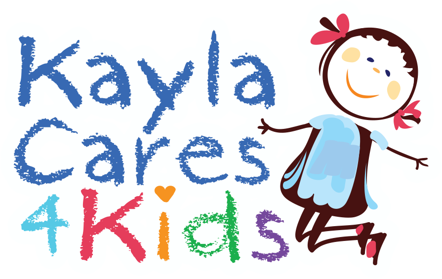

# Kayla Cares 4 Kids
## Operations Front-End
Kayla Cares 4 Kids, Inc. is a 501(c)(3) non-profit organization. Kayla Cares 4 Kids’ mission is to help sick kids feel better by providing entertainment and educational items to children’s hospitals, Ronald McDonald Houses and related pediatric facilities worldwide.

## Project Description
> Include: 
> General App Idea/Purpose 

 This project is the back-end and database connection to support the daily operations of their work. The first stage of this will be targeted toward inventory of donations of various entertainment and educational items. This will eventually grow to manage requests for items from their client hospitals and facilities as well as tracking the financial information that they need for managing the organization.

> What technology stack(s) are you using for your frontend / backend? 

I will be using PostgreSQL for the data store,
Flask for the api,
also considering firebase for backend and auth,
React Native for the front end to allow for mobile device usage for the receipt of donations

> Models including field names and their datatypes 

> A list of routes (e.g. `POST /pins/ allows users to post a picture of a pin`) 

POST            /user/register  create a new user account and log it in
POST            /user/login     log an existing user in
GET             /user/logout    log current user out

GET     INDEX   /items/         index of donated items
GET     SHOW    /items/:id      display info of one donation item
POST    CREATE  /items/         create a new row in the items table
DELETE  DESTROY /items/:id      delete row matching id from items table
PUT     UPDATE  /items/:id      update row with new values from the edit view

## Wireframes
> Wireframes with basic page layouts 
> Copy and paste or drag and drop your images here.

## Feasibility Study
> If you're using an external API or scraping a website, make sure you can get that data. If you're using a new language, framework, or tool, go through it's getting started tutorial. We *will* ask to see your results. If you are planning to use an API, please show an example of a successful fetch below to the API you wish to use in your project.

## User Stories
> User stories detailing app functionality 
> Add user stories following the _As a [type of user], I want [what the user wants], so that [what it helps accomplish]_ format.

### MVP Goals
- As a user I want to be able to load the app on my phone
- As a user I want to be able to create a user account
- As a user I want to be able to log into the app for my organization
- As a user I want to be able to add an item into the database
- As a user I want to be able to update an item in case I entered a typo
- As a user I want to be able to see what is the current available stock of items
- As a user I want to be able to delete an item if I need to

### Stretch Goals
- As a user I want to be able to track the requests from our clients and store them in the database
- As a user I want to be able to prepare a shipment of items from the inventory and automatically adjust the quatities of items
- As a user I want to be able to view the value of donations received durring a specified period
- As a user I want to be able to view the fair market value of items delivered to clients for a specified period
- As a user I want to be able to view the estimated number of children impacted by our serices
